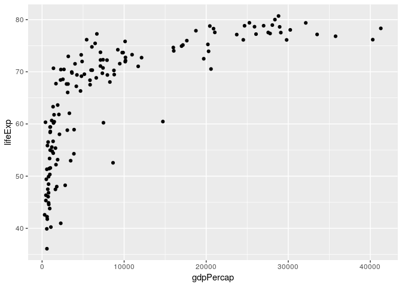
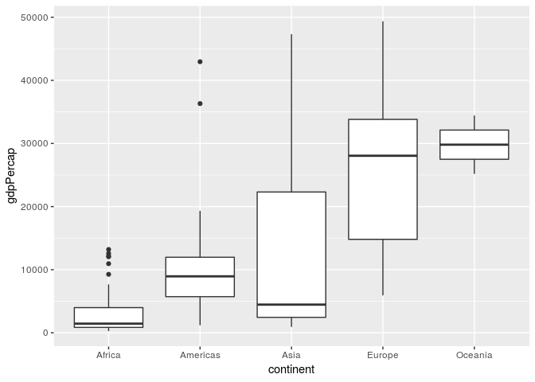
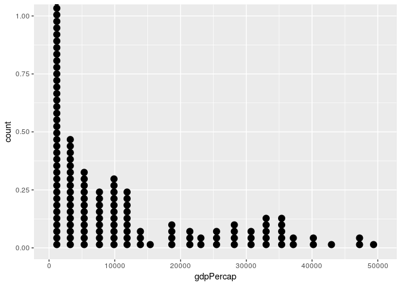

## R Markdown


```r
library(gapminder)
library(tidyverse)
```

```
## Warning: replacing previous import by 'tibble::as_tibble' when loading
## 'broom'
```

```
## Warning: replacing previous import by 'tibble::tibble' when loading 'broom'
```

```
## ── Attaching packages ──────────────────────────────────────────────────────────────────────────────────────────────────────────────────────────────────────────────────────────────────────────────────────────────────────────────────── tidyverse 1.2.1 ──
```

```
## ✔ ggplot2 3.0.0     ✔ purrr   0.2.5
## ✔ tibble  1.4.2     ✔ dplyr   0.7.6
## ✔ tidyr   0.8.1     ✔ stringr 1.3.1
## ✔ readr   1.1.1     ✔ forcats 0.3.0
```

```
## ── Conflicts ─────────────────────────────────────────────────────────────────────────────────────────────────────────────────────────────────────────────────────────────────────────────────────────────────────────────────────── tidyverse_conflicts() ──
## ✖ dplyr::filter() masks stats::filter()
## ✖ dplyr::lag()    masks stats::lag()
```

## Basic Exploration of Data

We can figure out what kind of dataset is by using the following command:

```r
class(gapminder)
```

```
## [1] "tbl_df"     "tbl"        "data.frame"
```
This dataset is therefore a data frame.

We extract the number of rows and columns in the dataset as follows:

```r
nrow(gapminder) # extracts number of dataset rows
```

```
## [1] 1704
```

```r
ncol(gapminder) # extracts number of dataset columns
```

```
## [1] 6
```
As we can see, the number of rows is 1704 and the number of columns is 6.

This gives us the types of all variables in the dataset:

```r
str(gapminder)
```

```
## Classes 'tbl_df', 'tbl' and 'data.frame':	1704 obs. of  6 variables:
##  $ country  : Factor w/ 142 levels "Afghanistan",..: 1 1 1 1 1 1 1 1 1 1 ...
##  $ continent: Factor w/ 5 levels "Africa","Americas",..: 3 3 3 3 3 3 3 3 3 3 ...
##  $ year     : int  1952 1957 1962 1967 1972 1977 1982 1987 1992 1997 ...
##  $ lifeExp  : num  28.8 30.3 32 34 36.1 ...
##  $ pop      : int  8425333 9240934 10267083 11537966 13079460 14880372 12881816 13867957 16317921 22227415 ...
##  $ gdpPercap: num  779 821 853 836 740 ...
```

They're 6 variables, country, continent, year, lifeExp, pop, and gdpPercap. Their types are Factor, Factor, integer, number, interger, and number, respectively.

## Exploration of Individual Variables

I will be exploring the qualitative "continent" and the quantitative variable "lifeExp".

```r
summary(gapminder$continent)
```

```
##   Africa Americas     Asia   Europe  Oceania 
##      624      300      396      360       24
```

```r
summary(gapminder$lifeExp)
```

```
##    Min. 1st Qu.  Median    Mean 3rd Qu.    Max. 
##   23.60   48.20   60.71   59.47   70.85   82.60
```
For the continent variable, they're 624 datapoints with Africa as a continent, 300 with the Americas, 396 with Asia, 360 with Europe, and 24 with Oceania. 
For the life expectancy variable, the maximum value is 82.60, the minimum value is 23.60, and the median value is 60.71. 

## Plotting and various dplyr Commands

For the following commands, I often use the piping syntax, to improve the readability of the code.

This is how we can select a column, in this case "lifeExp", from the dataset. We use the select, as follows:

```r
gapminder %>%
  select(lifeExp)
```

```
## # A tibble: 1,704 x 1
##    lifeExp
##      <dbl>
##  1    28.8
##  2    30.3
##  3    32.0
##  4    34.0
##  5    36.1
##  6    38.4
##  7    39.9
##  8    40.8
##  9    41.7
## 10    41.8
## # ... with 1,694 more rows
```

This is how we can select certain rows, in this case rows where the life expectancy exceeds 40, from the dataset. We use filter, as follows:

```r
gapminder %>%
  filter(lifeExp > 40)
```

```
## # A tibble: 1,579 x 6
##    country     continent  year lifeExp      pop gdpPercap
##    <fct>       <fct>     <int>   <dbl>    <int>     <dbl>
##  1 Afghanistan Asia       1987    40.8 13867957      852.
##  2 Afghanistan Asia       1992    41.7 16317921      649.
##  3 Afghanistan Asia       1997    41.8 22227415      635.
##  4 Afghanistan Asia       2002    42.1 25268405      727.
##  5 Afghanistan Asia       2007    43.8 31889923      975.
##  6 Albania     Europe     1952    55.2  1282697     1601.
##  7 Albania     Europe     1957    59.3  1476505     1942.
##  8 Albania     Europe     1962    64.8  1728137     2313.
##  9 Albania     Europe     1967    66.2  1984060     2760.
## 10 Albania     Europe     1972    67.7  2263554     3313.
## # ... with 1,569 more rows
```

The following code gives the mean life expectancy by year.

```r
gapminder %>%
  group_by(year) %>% # this line groups the data by year
  summarise(mean(lifeExp)) # this line compute the mean life expectancy for each year
```

```
## # A tibble: 12 x 2
##     year `mean(lifeExp)`
##    <int>           <dbl>
##  1  1952            49.1
##  2  1957            51.5
##  3  1962            53.6
##  4  1967            55.7
##  5  1972            57.6
##  6  1977            59.6
##  7  1982            61.5
##  8  1987            63.2
##  9  1992            64.2
## 10  1997            65.0
## 11  2002            65.7
## 12  2007            67.0
```

As one would expect, global life expectancy continues to increase as time goes on.

The following code shows the max population across all countries for various years between 1972 to 2007.

```r
gapminder %>%
  filter(year >= 1972) %>%
  group_by(year) %>% # this line groups the data by year, if the year is greater than or equal to 1972
  summarise(max(pop)) 
```

```
## # A tibble: 8 x 2
##    year `max(pop)`
##   <int>      <dbl>
## 1  1972  862030000
## 2  1977  943455000
## 3  1982 1000281000
## 4  1987 1084035000
## 5  1992 1164970000
## 6  1997 1230075000
## 7  2002 1280400000
## 8  2007 1318683096
```

The following commands plot life expectancy versus GDP per capita, in 1997, as a scatterplot.

```r
gapminder %>%
  filter(year == 1997) %>%
  ggplot(aes(gdpPercap, lifeExp)) + geom_point()
```

<!-- -->

From the plot, it seems as though places with a higher GDP per capita have higher life expectancies in general.

The following commands plot a boxplot, comparing the GDP per capita of the various continents (where each data point is a country) in 2007.

```r
gapminder %>%
  filter(year == 2007) %>%
  ggplot(aes(continent, gdpPercap)) + geom_boxplot()
```

<!-- -->

As we can see from the plot, it seems as though in general that Europe and Oceania have the highest GDP per capita, at least in 2007.

The following code produces a dotplot of the GDP per capita's of countries in 2007 (note that dotplot is very similar to a histogram, where each dot corresonds to a data point).

```r
gapminder %>%
  filter(year == 2007) %>%
  ggplot(aes(gdpPercap)) + geom_dotplot(dotsize=0.5, binwidth = 2000) # plots a dotplot with bins of size 2000
```

<!-- -->

As we can see, most countries have GDP per capita's between 0 to 40000, with very few greater than that.
